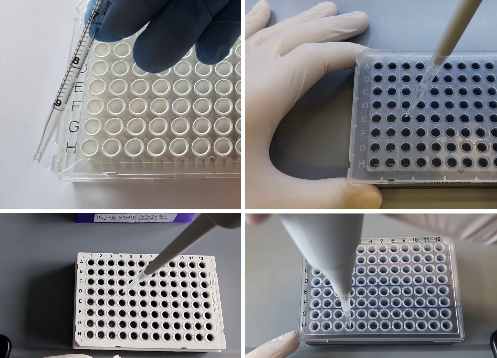
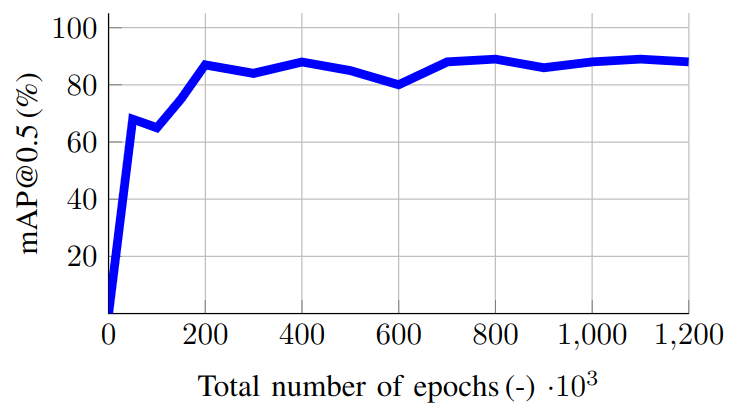
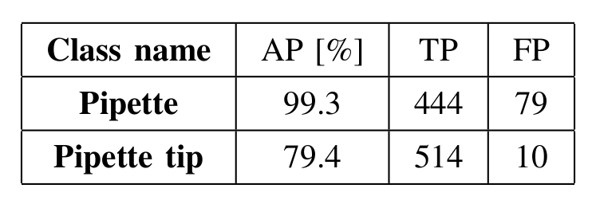

# Application of YOLOv7 for control of laboratory processes
This work deals with the problem of detection and evaluation of the pipetting process. The entire system is based on the use of a camera, respectively the camera of a mobile device or tablet, which is conveniently positioned to capture the scene being captured. All image processing, object detection using the YOLOv7 (You Only Look Once 7. version) model and subsequent other operations are performed on a mobile device or tablet. The YOLOv7 neural network model was trained on our own prepared dataset. This training set was created specifically for the analysis of the pipetting process. The result of this work is a prepared annotated dataset and a trained YOLOv7 neural network model, which is aimed at detecting the entire pipette and the tip of this pipette in the image scene. The output of the work is also an implemented algorithm that can perform a complex analysis of the pipetting process using the trained YOLOv7 model.

<b>Representanting video of this work can be found at:</b> 
https://youtu.be/O4hSeHlCPJ4

<b>The dataset, scripts and other files used in this work can be found at:</b> 
https://drive.google.com/drive/folders/1pCiBqvItr4K8-zJZ3WTG0lvnNh--s22S?usp=sharing

<b>To start training neural network model YOLOv7 with framework darknet:</b> 
<code>python train.py --workers 1 --device 0 --batch-size 1 --epochs 250 --img 640 640 --data data/coco_custom.yaml --hyp data/hyp.scratch.custom.yaml --cfg cfg/training/yolov7_custom.yaml --name yolov7_custom --weights yolov7.pt</code>

<b>To start testing inference of learned neural network model YOLOv7:</b> 
<code>python detect.py --weights yolov7.pt --conf 0.5 --img-size 640 --source ./video/pipettingProcess001.mp4</code>

<b>Model training results:</b>

  

  

